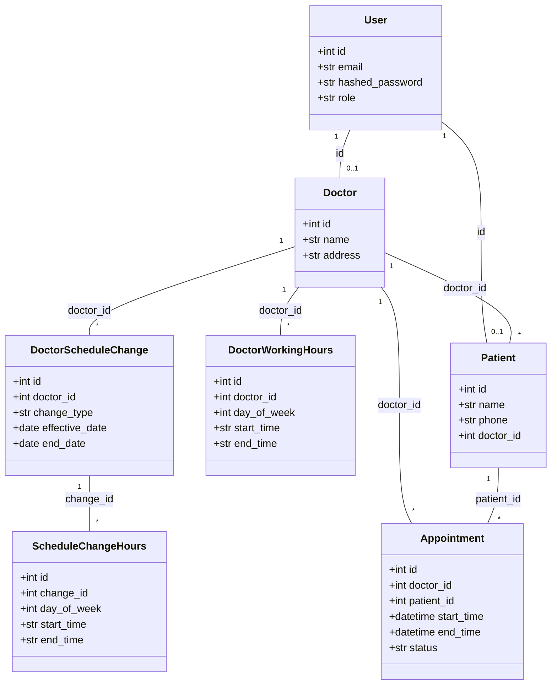
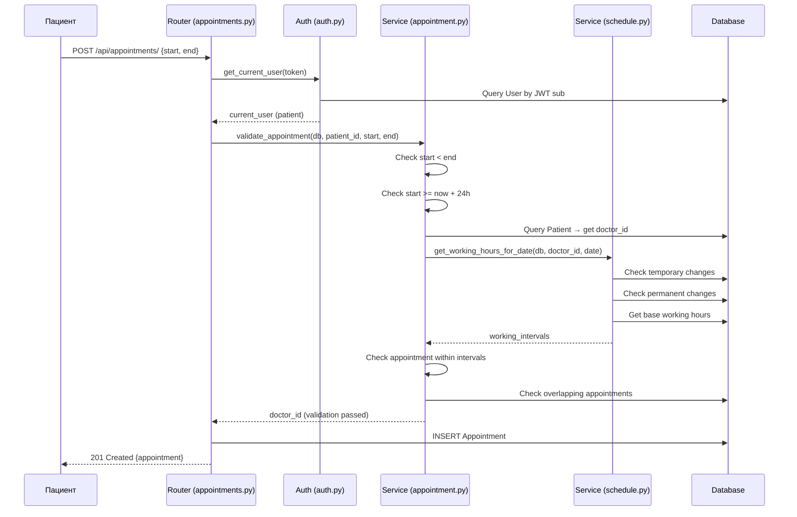
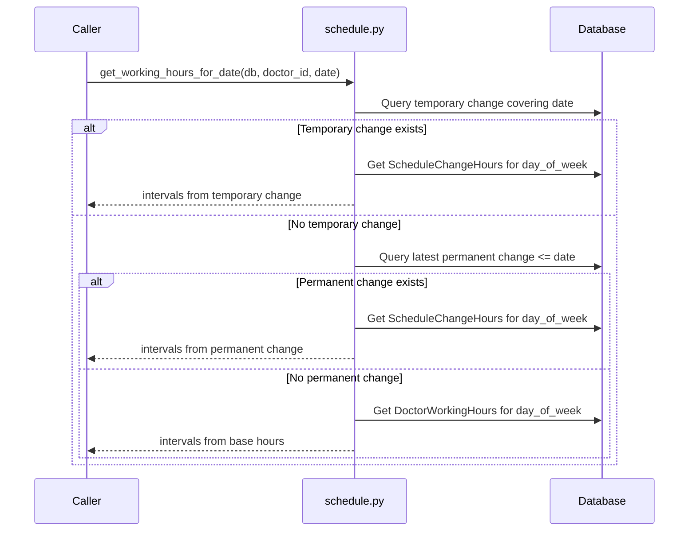

# Архитектура на проекта

## 1. Структура на проекта

Проектът следва трислойна архитектура:

```
app/
├── main.py              # Входна точка — създаване на FastAPI приложението
├── database.py          # Конфигурация на база данни (SQLAlchemy engine, сесия)
├── auth.py              # JWT автентикация и оторизация
├── models.py            # ORM модели (таблици в базата данни)
├── schemas.py           # Pydantic схеми (входни/изходни данни)
├── routers/             # HTTP слой — обработка на заявки
│   ├── auth.py          # Вход (login)
│   ├── doctors.py       # Регистрация на лекар, управление на работно време
│   ├── patients.py      # Регистрация на пациент
│   └── appointments.py  # Създаване, отмяна, преглед на посещения
└── services/            # Бизнес логика
    ├── schedule.py      # Разрешаване на работно време
    └── appointment.py   # Валидация на посещения
tests/
├── conftest.py          # Тестови фикстури (in-memory DB, тестов клиент)
├── test_doctors.py      # Тестове за лекари и работно време
├── test_patients.py     # Тестове за пациенти
└── test_appointments.py # Тестове за посещения
```

### Слоеве и отговорности

| Слой | Файлове | Отговорност |
|------|---------|-------------|
| **Routers** | `routers/*.py` | HTTP обработка — парсване на заявки, връщане на отговори, HTTP кодове |
| **Services** | `services/*.py` | Бизнес логика — валидация, изчисления, правила |
| **Models** | `models.py` | Persistence — ORM маппинг към SQLite таблици |
| **Schemas** | `schemas.py` | Договор — дефиниция на входни и изходни данни |
| **Auth** | `auth.py` | Сигурност — JWT токени, хеширане на пароли, role guards |

---

## 2. Ключови класове и модели

### ORM модели (`models.py`)

- **User** — базов потребител с email, парола и роля (`doctor`/`patient`)
- **Doctor** — име и адрес, свързан с User чрез споделен първичен ключ
- **Patient** — име, телефон и личен лекар (FK към Doctor)
- **DoctorWorkingHours** — интервали от работно време за конкретен ден от седмицата
- **DoctorScheduleChange** — временна или постоянна промяна на работно време
- **ScheduleChangeHours** — интервали на работно време за дадена промяна
- **Appointment** — посещение с начало, край, пациент, лекар и статус

### Ключови методи

- `get_working_hours_for_date(db, doctor_id, date)` (`services/schedule.py`) — определя работното време на лекар за конкретна дата с приоритет: временна промяна > постоянна промяна > базово работно време
- `validate_appointment(db, patient_id, start, end)` (`services/appointment.py`) — проверява всички бизнес правила за създаване на посещение
- `create_access_token(user_id, role)` (`auth.py`) — генерира JWT токен
- `get_current_user(token, db)` (`auth.py`) — FastAPI dependency за извличане на текущия потребител от токен

---

## 3. Обосновка на архитектурни решения

### Защо FastAPI?
- Автоматична генерация на OpenAPI/Swagger документация
- Вградена валидация чрез Pydantic
- Dependency injection система (`Depends()`) за чиста автентикация
- Модерен Python фреймуърк с добра документация

### Защо SQLite + SQLAlchemy?
- SQLite не изисква инсталация или конфигурация — грейдърът само стартира `uvicorn`
- SQLAlchemy предоставя ORM модели, които директно се мапват към UML диаграми
- За мащаба на проекта SQLite е напълно достатъчен

### Защо интервали за работно време (не ден-ниво)?
Работното време е моделирано като множество интервали (`start_time`, `end_time`) за даден ден. Това позволява естествено моделиране на обедни почивки без отделна таблица. Например:
- Понеделник 09:00-12:00 + 13:00-17:00 = обедна почивка от 12:00 до 13:00

### Защо единна `users` таблица?
Една таблица за автентикация с колона `role` опростява JWT логиката — не са необходими отделни login потоци за лекари и пациенти. Специфичните данни се пазят в `doctors`/`patients` таблици, свързани чрез споделен първичен ключ.

### Защо soft-delete за отмяна?
Отменените посещения получават `status = "cancelled"` вместо да се изтриват. Това запазва историята и предотвратява бъгове при проверка за припокриване.

---

## 4. UML диаграми

### Клас диаграма (Entity Relationship)



### Секвенциална диаграма — Създаване на посещение



### Секвенциална диаграма — Разрешаване на работно време


